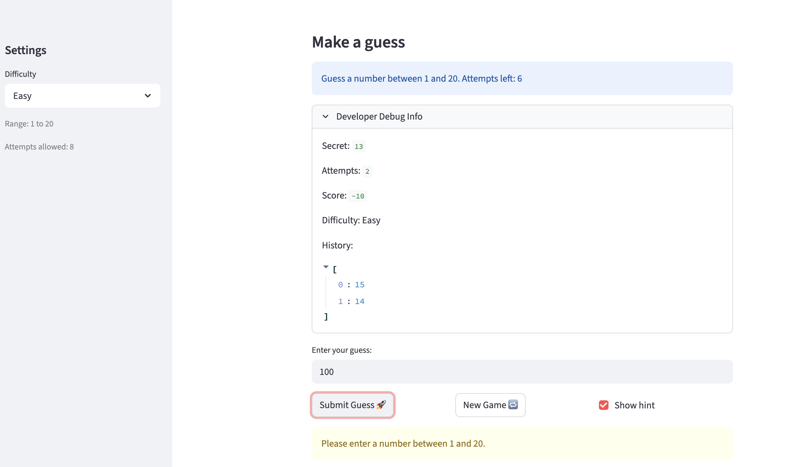
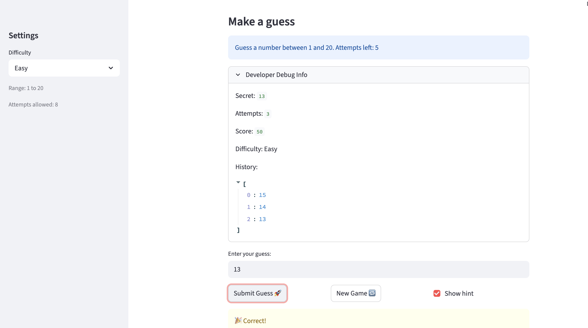

# 🎮 Game Glitch Investigator: The Impossible Guesser

## 🚨 The Situation

You asked an AI to build a simple "Number Guessing Game" using Streamlit.
It wrote the code, ran away, and now the game is unplayable. 

- You can't win.
- The hints lie to you.
- The secret number seems to have commitment issues.

## 🛠️ Setup

1. Install dependencies: `pip3 install -r requirements.txt`
2. Run the broken app: `python3 -m streamlit run app.py`

## 🕵️‍♂️ Your Mission

1. **Play the game.** Open the "Developer Debug Info" tab in the app to see the secret number. Try to win.
2. **Find the State Bug.** Why does the secret number change every time you click "Submit"? Ask ChatGPT: *"How do I keep a variable from resetting in Streamlit when I click a button?"*
3. **Fix the Logic.** The hints ("Higher/Lower") are wrong. Fix them.
4. **Refactor & Test.** - Move the logic into `logic_utils.py`.
   - Run `pytest` in your terminal.
   - Keep fixing until all tests pass!

## 📝 Document Your Experience

- [x] Describe the game's purpose.
  - The game is a number guessing game where the app picks a secret number and you try to guess it within a limited number of attempts.
  - After each guess, the app gives a hint to guide you higher or lower.

- [x] Detail which bugs you found.
  - **Bug 1 (Logic Bug - Backwards Hints):** The `check_guess()` function had the hint messages swapped. When the player's guess was higher than the secret number, the app showed "Go HIGHER" (which would push the player further away). When the guess was lower, it showed "Go LOWER" (also wrong). This made it impossible to follow the hints and win.
  - **Bug 2 (Type Bug - String Conversion on Even Attempts):** Inside the submit block, the code checked `if st.session_state.attempts % 2 == 0` and converted the secret number to a string on every even-numbered attempt (2nd, 4th, 6th click). This caused a `TypeError` when Python tried to compare an integer guess to a string secret. The game would fall into the `except TypeError` block in `check_guess()`, where the hints were also still backwards. So on even attempts, both the comparison and the hints were broken.
  - **Bug 3 (State Bug - New Game Button Not Fully Resetting):** When the "New Game" button was clicked, it only reset `attempts` and `secret`. It did NOT reset `status`, `history`, or `score`. Since `status` was still set to `"won"` or `"lost"` from the previous game, the app would immediately hit `st.stop()` and block the submit button, making it impossible to play again without refreshing the entire page.
  - **Bug 4 (Initial Attempts Starting at 1):** On a fresh page load, the attempts counter was initialized to `1` instead of `0`. This meant the player already appeared to have used one attempt before clicking anything, and the "Attempts left" count showed one fewer than it should.
  - **Bug 5 (Wrong Difficulty Ranges and Hardcoded Message):** The difficulty ranges were incorrectly set. Normal had the widest range (1-100) and Hard had a smaller range (1-50), which meant Hard was actually easier to guess than Normal. The info message also always showed "1 and 100" no matter which difficulty was selected. The attempt limits were also wrong. Easy had fewer attempts (6) than Normal (8), when it should be the other way around since Easy should give the player more chances.
  - **Bug 6 (Attempts Counter Not Syncing Immediately):** The info message ("Attempts left") and the Developer Debug Info panel did not update on the same click when Submit was pressed. They always showed the count from the previous click. For example, on the first guess it still showed "Attempts left: 6" instead of "Attempts left: 5". This was a Streamlit timing issue. The info message and debug panel were rendered at the top of the script before the submit handler ran and updated `st.session_state.attempts`, so they always showed stale values.
  - **Bug 7 (Difficulty Switch Not Resetting the Game):** When switching difficulty from the sidebar, the secret number stayed the same and was not regenerated within the new range. For example, switching from Hard (1-100) to Easy (1-20) could leave the secret as 95, which is outside the Easy range, making it impossible to win. The debug info and sidebar were also out of sync with the new difficulty.
  - **Bug 8 (Score Rewarding Wrong Guesses):** The `update_score()` function was adding +5 points when a guess was too high on even-numbered attempts, instead of always subtracting. This meant wrong guesses were sometimes being rewarded, which made no sense for a scoring system.
  - **Bug 9 (No Range Validation):** The game accepted any number the player typed, even if it was outside the allowed range for the selected difficulty. For example, on Easy (1-20) you could type 999 and it would count as a wasted attempt instead of warning you.

- [x] Explain what fixes you applied.
  - **Bug 1:** The problem was in the `check_guess()` function. The messages were simply put in the wrong place. When your guess is too high, you need to go lower, and vice versa. The fix was to swap the two messages so each one appears in the correct condition.
  - **Bug 2:** The code was intentionally converting the secret number from an integer to a string on every 2nd, 4th, and 6th attempt. Python cannot compare a number and a string directly, so it crashed silently into broken behavior. The fix was to remove that conversion entirely so the secret always stays as a number.
  - **Bug 3:** The "New Game" button was only resetting two things (attempts and secret) but forgetting to reset the game's status, score, and guess history. Because the status was still "won" or "lost", the app would immediately stop and block the player. The fix was to also reset `status` back to `"playing"`, clear the `history` list, and reset the `score` to 0 so everything starts fresh like a real new game.
  - **Bug 4:** The attempts counter was initialized to `1` when the page first loaded, even before the player clicked anything. This made it look like one attempt was already used. The fix was simply changing the starting value from `1` to `0` so the counter begins at zero and only increases when the player actually clicks Submit.
  - **Bug 5:** The difficulty ranges and attempt limits were swapped and hardcoded. Fixed the ranges so Easy=1-20, Normal=1-50, Hard=1-100, and the attempt limits so Easy=8, Normal=6, Hard=4. Also replaced the hardcoded "1 and 100" in the info message with dynamic variables so it always shows the correct range for the selected difficulty.
  - **Bug 6:** This took two tries to fix.
    - **First try:** Added a placeholder at the top for the info message and tried to calculate the correct attempts count using `display_attempts = st.session_state.attempts + (1 if submit else 0)`. This helped the info message but the debug panel still showed the wrong count. It also moved the buttons to the top of the page, which changed the layout in a way that looked off.
    - **Why it didn't fully work:** In Streamlit, every button click reruns the whole script from top to bottom. The debug panel was being drawn before the Submit button was even processed, so it always showed the old count one step behind.
    - **ChatGPT's fix (what actually worked):** Save empty spots (placeholders) at the top for both the info message and the debug panel. Then render the input and buttons. Then handle the Submit/New Game clicks and update the game state. Finally, fill in the placeholders at the very end after all the state is already updated. This way both the info message and the debug panel show the correct number immediately on the same click.
  - **Bug 7:** Added a check that tracks the previously selected difficulty in `st.session_state.difficulty_prev`. Every time the script runs, it compares the current difficulty to the saved one. If they are different, it automatically generates a new secret within the correct range, resets attempts, score, history, and status, and updates the saved difficulty. This way switching difficulty instantly starts a fresh game with the right number range.
  - **Bug 8:** Removed the even/odd check inside `update_score()` for "Too High" guesses. Now both "Too High" and "Too Low" always subtract 5 points. Wrong guesses are never rewarded.
  - **Bug 9:** Added a range check right after the guess is parsed. If the number is outside the allowed range for the selected difficulty, the app shows a warning message and cancels the attempt so the player doesn't lose a turn for typing out of range.

## 📸 Demo

- [x] Range validation in action (typing 100 on Easy mode):

  

  - [x] Winning the game:
  
  

## 🚀 Stretch Features

- [ ] [If you choose to complete Challenge 4, insert a screenshot of your Enhanced Game UI here]
